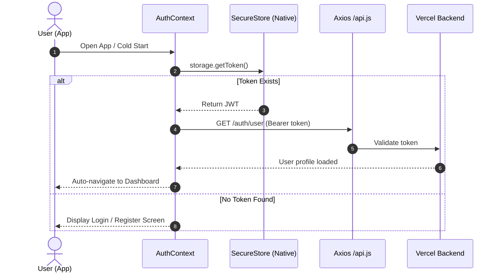
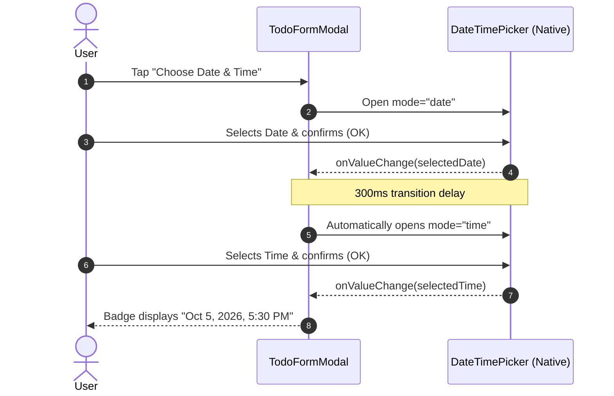

# 📱 Taskly — Cross-Platform Mobile Client

<p align="center">
  
</p>

<p align="center">
  <strong>Taskly</strong> is a modern, high-performance cross-platform task management mobile application built with <strong>React Native</strong>, <strong>Expo (SDK 57)</strong>, and <strong>Expo Router</strong>. Designed with native-first aesthetics, seamless offline-ready token storage, native date & time picking, task media attachments, and real-time backend synchronization.
</p>

<p align="center">
  
  
  
  
  
  
</p>

---

## 📑 Table of Contents

- [Key Features](#-key-features)
- [Tech Stack & Architecture](#-tech-stack--architecture)
- [Project Directory Structure](#-project-directory-structure)
- [Prerequisites](#-prerequisites)
- [Quick Start Guide](#-quick-start-guide)
- [Environment Configuration](#-environment-configuration)
- [Building Android APK (EAS Cloud)](#-building-android-apk-eas-cloud)
- [Key Architectural Workflows](#-key-architectural-workflows)
- [Code Quality & Linting](#-code-quality--linting)
- [Author & Credits](#-author--credits)

---

## ✨ Key Features

- 🎨 **Premium Native UI/UX:** Tailored HSL design system, elevation shadows, fluid keyboard avoidance, smooth sheet modals, and modern typography.
- 🔐 **Secure Session Management:** Persistent JWT storage using native **`expo-secure-store`** (Android Keystore / iOS Keychain) with automatic session recovery and seamless logout.
- 📋 **Full Task CRUD Life-Cycle:** Create, edit, delete, toggle completion, set priorities (`Low`, `Medium`, `High`), and add descriptive notes.
- ⏰ **Native Dual Date & Time Picker:** 
  - Integrated `@react-native-community/datetimepicker` with automatic sequential picking (**Date ➔ Time**).
  - Dedicated interactive pills to modify Date and Time independently.
  - 1-tap quick presets: `Today`, `Tomorrow`, `+7 Days`, `9:00 AM`, `1:00 PM`, `6:00 PM`, `9:00 PM`.
- 🔍 **Instant Search & Dynamic Filter Tabs:**
  - Real-time task filtering (`All`, `Active`, `Completed`) with dynamic badge counters.
  - Live query search with single-tap quick clear button and active match feedback.
- 📸 **Cloudinary Media Attachments:** Attach task cover images directly from the device gallery via `expo-image-picker` with direct multipart upload to Cloudinary.
- 🚀 **Cloud Build Optimized:** Preconfigured for **EAS Build** to generate direct installable `.apk` packages without requiring a local Android Studio / SDK setup.
- 🌐 **Cross-Platform:** Runs flawlessly on physical Android devices via Expo Go, standalone Android APK, iOS Simulator, and Web.

---

## 🛠️ Tech Stack & Architecture

| Layer | Library / Tool | Version | Purpose |
| :--- | :--- | :--- | :--- |
| **Framework** | [Expo](https://expo.dev) | SDK `~57.0` | Universal React platform & native runtime |
| **Mobile Core** | [React Native](https://reactnative.dev) | `0.86.3` | Cross-platform native component engine |
| **Language** | [JavaScript / JSX](https://developer.mozilla.org/en-US/docs/Web/JavaScript) | ESNext | Core application logic and reactive components |
| **Routing** | [Expo Router](https://docs.expo.dev/router/introduction/) | `~57.0.24` | File-based typed native navigation and modal sheets |
| **State & Auth** | Context API & Hooks | React `19.2` | Global authentication and reactive task state |
| **Secure Storage** | [`expo-secure-store`](https://docs.expo.dev/versions/latest/sdk/securestore/) | `~57.0.4` | Hardware-backed cryptographic token persistence |
| **Network Client** | [Axios](https://axios-http.com/) | `^1.20.0` | HTTP client with automatic Bearer token injection |
| **Date & Time** | [`@react-native-community/datetimepicker`](https://github.com/react-native-datetimepicker/datetimepicker) | `9.1.0` | Native Android & iOS calendar and clock dialogs |
| **Image Picker** | [`expo-image-picker`](https://docs.expo.dev/versions/latest/sdk/imagepicker/) | `~57.0.20` | Native photo library picker with image compression |
| **Icons** | [`@expo/vector-icons`](https://icons.expo.fyi/) | `^15.0.2` | High-definition Ionicons iconography |
| **Cloud Build** | [EAS CLI](https://docs.expo.dev/eas/) | `^24.x` | Cloud APK compilation and automated deployment |

---

## 📂 Project Directory Structure

```text
Client/
├── assets/                  # App icons, splash screens, and graphical assets
│   └── Glossy 3D Task List Icon.png
├── src/
│   ├── app/                 # Expo Router routes (File-based navigation)
│   │   ├── (auth)/          # Authentication route group
│   │   │   ├── login.jsx
│   │   │   └── register.jsx
│   │   ├── _layout.jsx      # Root Stack navigator & AuthProvider wrapper
│   │   └── index.jsx        # Landing route (Auto-redirects to Auth or Home)
│   ├── components/          # Scalable & reusable UI components
│   │   ├── todos/           # Feature-specific components
│   │   │   ├── todo-empty-state.jsx
│   │   │   ├── todo-filter-tabs.jsx
│   │   │   ├── todo-form-modal.jsx   # Dual Date/Time picker & task form
│   │   │   └── todo-item.jsx         # Task item card with swipe/press actions
│   │   └── ui/              # Atom components
│   │       ├── button.jsx   # Premium button with loading states
│   │       └── input.jsx    # Accessible text fields with error states
│   ├── context/             # Global Application Context
│   │   └── auth-context.jsx # Auth state, login/register, token synchronization
│   ├── screens/             # Screen implementations
│   │   ├── auth/            # Login and Register UI screens
│   │   │   ├── login-screen.jsx
│   │   │   └── register-screen.jsx
│   │   └── todos/           # Main Task List dashboard screen
│   │       └── todo-list-screen.jsx
│   ├── services/            # API integration layer
│   │   ├── api.js           # Axios instance & dynamic environment base URL
│   │   ├── auth-service.js  # Authentication endpoints integration
│   │   └── todo-service.js  # Todos CRUD and multipart image upload
│   ├── theme/               # Design Tokens
│   │   └── colors.js        # Modern harmonious color palette
│   └── utils/               # Helper utilities
│       └── storage.js       # SecureStore abstraction for auth tokens
├── .env                     # Local environment configuration
├── app.json                 # Expo project manifest & Android package config
├── eas.json                 # EAS Cloud Build profiles (APK & Production)
├── eslint.config.js         # ESLint configuration
├── package.json             # Dependencies and scripts
├── tsconfig.json            # TypeScript configuration
└── README.md                # Project documentation
```

---

## 📋 Prerequisites

Before running the client locally, ensure you have:

1. **Node.js**: `v18.0.0` or higher ([Download Node.js](https://nodejs.org/))
2. **npm** or **bun**: Package manager
3. **Expo Go App**: Installed on your physical Android/iOS device from Google Play Store or Apple App Store.
4. **Backend Server**: Either local server running at `http://<YOUR_LAN_IP>:8000` or live deployed Vercel API (`https://taskly-server-nine.vercel.app`).

---

## 🚀 Quick Start Guide

### 1. Clone & Install Dependencies

```bash
git clone https://github.com/SufyanAli-7/Taskly.git
cd Taskly/Client
npm install
```

### 2. Configure Environment URL

Create a `.env` file in the `Client/` directory:

```env
# Point to your production Vercel backend or local IP
EXPO_PUBLIC_API_URL=https://taskly-server-nine.vercel.app
```

> **Tip:** If developing locally with a local backend server, you can set `EXPO_PUBLIC_API_URL=http://<YOUR_COMPUTER_IP>:8000`.

### 3. Start Development Server

```bash
npx expo start -c
```

- **Physical Phone:** Scan the QR code displayed in the terminal using the **Expo Go** app (Android) or Camera app (iOS).
- **Android Emulator:** Press `a` in the terminal.
- **Web Browser:** Press `w` in the terminal.

---

## ⚙️ Environment Configuration

The client dynamically resolves the backend URL according to the following priority rule defined in [src/services/api.js](src/services/api.js):

1. **`EXPO_PUBLIC_API_URL`**: Explicit `.env` or `eas.json` variable (Highest Priority).
2. **`Constants.expoConfig.hostUri`**: Auto-detected computer LAN IP when running via Expo Go.
3. **`10.0.2.2:8000`**: Default Android Studio Emulator loopback address.
4. **`localhost:8000`**: Default Web / iOS Simulator fallback.

---

## 📦 Building Android APK (EAS Cloud)

Taskly is configured with **EAS Build** to compile standalone `.apk` packages in the cloud. No heavy Android SDK or Android Studio installation is required on your machine.

### 1. Configure EAS Build Profile (`eas.json`)

The project includes an APK configuration in [eas.json](eas.json):

```json
{
  "cli": {
    "version": ">= 16.0.1"
  },
  "build": {
    "preview": {
      "distribution": "internal",
      "android": {
        "buildType": "apk"
      },
      "env": {
        "EXPO_PUBLIC_API_URL": "https://taskly-server-nine.vercel.app"
      }
    }
  }
}
```

### 2. Log in to Expo EAS

```bash
npx eas-cli login
```

### 3. Trigger Cloud APK Build

```bash
npx eas-cli build -p android --profile preview
```

- EAS will provision a cloud build container, link your credentials, and compile the native Android bundle.
- Upon completion (usually 5–8 minutes), a **direct APK download URL** and QR code will appear in your terminal and on your [Expo Dashboard](https://expo.dev).
- Download the `.apk` file directly to any Android smartphone and install!

---

## 🔄 Key Architectural Workflows

### Authentication & Token Storage Flow



### Native Date & Time Picking Sequence



---

## 🧹 Code Quality & Linting

Before pushing code or creating builds, run the automated verification checks:

```bash
# Typecheck TypeScript definitions
npx tsc --noEmit

# Run Expo ESLint
npx expo lint

# Diagnose dependency health
npx expo-doctor
```

---

## 👤 Author & Credits

- **Author:** Sufyan Ali
- **GitHub:** [@SufyanAli-7](https://github.com/SufyanAli-7)
- **Backend Repository:** [Taskly-Server](https://github.com/SufyanAli-7/Taskly-Server)
- **Client Repository:** [Taskly](https://github.com/SufyanAli-7/Taskly)

---

<p align="center">
  <sub>Crafted with passion using React Native & Expo.</sub>
</p>
